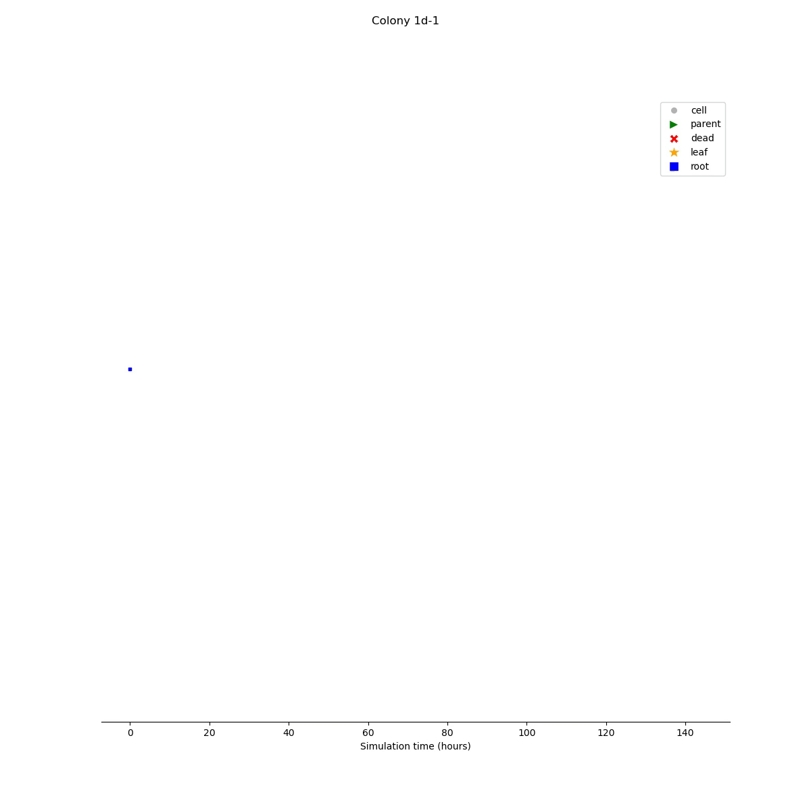

# CloVarS: a clonal variability simulation
This repository contains the source code accompanying the article "CloVarS: a simulation of clonal variability in single cells" (in preparation).

<p align="center" width="100%">
    
</p>

## What is CloVarS
The **Clo**nal **Var**iability **S**imulation (CloVarS) is a cell culture simulation that generates synthetic single-cell lineage data, as normally obtained from time-lapse microscopy experiments.

See the examples below for yourself:

<p align="center" width="100%">
    
</p>

<p align="center" width="100%">
    
</p>

## Installation
CloVarS requires Python version 3.9+ in order to run.

CloVarS can be installed in your Python environment with the command:
```shell
pip install clovars
```
This command adds the `clovars` command to your Python environment, while also installing the necessary [dependencies](#dependencies).

## How to use CloVarS
CloVarS can be executed in the following modes: 
- `run` - run a simulation with the given settings;
- `view` - visualize the results of a previous simulation run (figures, images, videos);
- `analyse` - run analytical tools on the result of a previous simulation run.

You also need to provide the necessary [settings files](settings). These files use the [TOML](https://toml.io/en/) syntax, which makes it easy to open and edit them in any text editor.

[This folder](settings) has examples for the structure of the settings files. **CloVarS will likely run into errors if the settings are not in the proper format!**
### Run CloVarS
To run CloVarS, enter the following command in a terminal:
```shell
clovars run <path-to-run-settings> <path-to-colonies>
```
where: 
- `path-to-run-settings` is the path for a TOML file with the run settings;
- `path-to-colonies` is the path for a TOML file with the colony description.
### View CloVarS
To view the result of a previous CloVarS run, enter the following command in a terminal:
```shell
clovars view <path-to-view-settings>
```
where `path-to-view-settings` is the path for a TOML file with the view settings.
### Analyse CloVarS
To run analytical scripts on the results of a previous CloVarS run, enter the following command in a terminal:
```shell
clovars analyse <path-to-analysis-settings>
```
where `path-to-analysis-settings` is the path for a TOML file with the analysis settings.

## Dependencies
CloVarS depends on the following third-party packages:
- ete3
- matplotlib
- numpy
- pandas
- scipy
- seaborn

## License
CloVarS is distributed under the MIT license. Read the `LICENSE.md` file for details.
