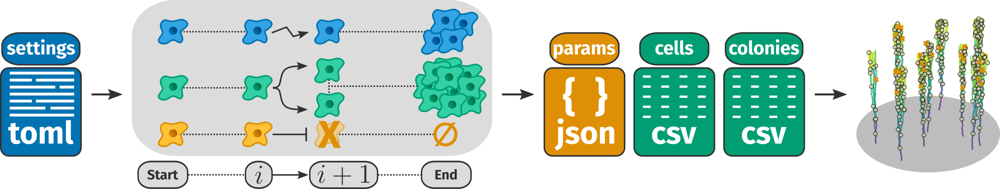

# CloVarS: a clonal variability simulation of single cells
This repository contains the source code accompanying the article "CloVarS: a simulation of clonal variability in single cells" (in preparation).

<p align="center" width="100%">
    
</p>

## What is CloVarS
The **Clo**nal **Var**iability **S**imulation (CloVarS) is a cell culture simulation that generates synthetic single-cell lineage data, as normally obtained from time-lapse microscopy experiments.

The example below depicts a single colony, starting from a single cell, which grows over 7 days:

<p align="center" width="100%">
    
</p>

## Installation
CloVarS requires **Python version 3.8+** in order to run. You can install CloVarS in your Python environment with the command:
```shell
pip install clovars
```
This adds the `clovars` command to your Python environment, and also installs the necessary [dependencies](#dependencies).

## How to use CloVarS
CloVarS can be executed in the following modes: 
- `run` - run a simulation with the given settings;
- `view` - visualize the results of a previous simulation run (figures, images, videos);
- `analyse` - run analytical tools on the result of a previous simulation run;
- `fit` - fut experimental data to a variety of curves.

You also need to provide the necessary **settings files** as command-line arguments. 

These files use the [TOML](https://toml.io/en/) syntax, which makes it easy to open and edit them in any text editor. [This folder](examples) has examples for the structure of the settings files.

Be sure to pay attention: CloVarS will likely **run into errors** if the setting files have **incorrect or missing values!**

For more information on the settings and their meaning, please [read the docs here](http://www.ufrgs.br/labsinal/clovars/docs).

### Run
```shell
clovars run <run-settings-file> <colonies-file>
```
where: 
- `run-settings-file` is the path for a TOML file with the run settings;
- `colonies-file` is the path for a TOML file with the colony description.

### View
```shell
clovars view <view-settings-file>
```
where:
- `view-settings-file` is the path for a TOML file with the view settings.

### Analyse
```shell
clovars analyse <analysis-settings-file>
```
where: 
- `analysis-settings-file` is the path for a TOML file with the analysis settings.

### Fit experimental data
```shell
clovars fit <fit-settings-file>
```
where:
- `fit-settings-file` is the path for a TOML file with the fit settings.

Please refer to [this folder](examples) for examples on how the experimental data should be formatted. 

## Dependencies
CloVarS depends on the following third-party Python packages:
- [ete3](http://etetoolkit.org/)
- [matplotlib](https://matplotlib.org/)
- [numpy](https://numpy.org/)
- [pandas](https://pandas.pydata.org/)
- [scipy](https://scipy.org/)
- [seaborn](https://seaborn.pydata.org/)

## License
CloVarS is distributed under the MIT license. Read the [`LICENSE.md`](LICENSE.md) file for details.

## Cite us
If you use CloVarS, cite us: *Faccioni, JL; Lenz, G.* (in preparation).
